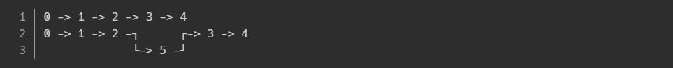

Stack
====
스택이란
---
* 스택이란 목록 한쪽 끝에서만 데이터를 넣거나 뺄 수 있는 자료구조의 일종이다. 
* 데이터를 넣는 것을 ‘밀어넣는다’는 의미의 푸시(push), 반대로 넣어둔 데이터를 꺼내는 것을 팝(pop)이라고 합니다. 
* 팝으로 꺼내진 데이터는 가장 마지막에 푸시한 데이터이다.(Last In First Out, LIFO)  

Java의 Stack 클래스
---
Java의 Stack 클래스는 push,pop,peek,empty,search 메서드를 제공합니다.
<pre>
public void push(Element data); //순차보관
public Element pop();   //가장 최근에 보관한 값 꺼내고 반환
public Element peek();  //가장 최근에 보관한 값 단순 참조, 꺼내지 않음
public boolean empty();     //비어있는지 판별
public int search(Element data);     //data를 보관한 순번 반환(1부터 시작)
</pre>

예시 1
----
<pre>
import java.util.Stack;
public class Program {
	public static void main(String[] args){
		Stack stack = new Stack();
		stack.push(3); //3
		stack.push(2); //3, 2
		System.out.println(stack.pop()); //2를 출력, 스택에는 3
		stack.push(6); //3, 6
		stack.push(8); //3, 6, 8
		System.out.println(stack.peek()); //가장 최근에 보관한 값은 8 
		System.out.println(stack.search(6));//두 번째 보관한 요소임
		while(stack.empty()==false){
			System.out.println(stack.pop());//8, 6, 3 순으로 꺼냄
		}
	}
}
</pre>
* 실행 결과
> 2       
8  
2  
8  
6  
3

Linked List(연결리스트)
====
***배열의 단점***

배열은 가장 기본적인 형태의 자료구조로 구조가 간단하며, 사용하기 쉽고 데이터를 읽어오는데 걸리는 시간이 가장 빠르다는 장점을 가지고 있지만 크기를 변경할 수 없고 비순차적인 데이터의 추가, 삭제에 시간이 많이 걸리는 단점을 가지고 있다.
* 이러한 배열의 단점을 보완하기 위해서 LinkedList라는 자료구조가 고안 되었다.
* 배열은 모든데이터가 연속적으로 존재하지만 LinkedList는 불연속적으로 존재하는 데이터를 서로 연결한 형태로 구성되어있다.

***LinkedList 형태***

각 요소들은 자신과 연결된 다른 요소에 대한 참조(주소값)와 데이터로 구성되어있다.

***LinkedList 데이터 삭제 형태***

LinkedList에서의 데이터 삭제는 간단하다. 삭제하고자하는 요소의 이전요소가 삭제하고자하는 요소의 다음 요소를 참조하도록 변경하기만 하면 된다. 단 하나의 참조만 변경하면 삭제가 이루어지기 때문에 배열처럼 데이터를 이동하기위해 복사하는 과정없이 빠르게 처리가 가능하다.

***LinkedList 데이터 추가 형태***

새로운 데이터를 추가할때는 새로운 요소를 생성한 다음 추가하고자 하는 위치의 이전 요소의 참조를 새로운 요소에 대한 참조로 변경해주고, 새로운 요소가 그 다음 요소를 참조하도록 변경하기만 하면되므로 처리속도가 매우 빠르다.

Doubly Linked List(이중 연결리스트)
====
LinkedList는 이동방향이 단방향이기 때문에 다음 요소에 대한 접근은 쉽지만 이전 요소에 대한 접근이 어렵다. 이러한 단점을 보완한 것이 Doubly Linked List(이중 연결리스트)이다. 단순히 LinkedList 리스트에 이전 요소에 대한 참조가 가능하도록만 했을 뿐 다른점은 없다. 

***Doubly LinkedList 형태***

Doubly Circular Linked List(이중 원형 연결리스트)
====
Doubly Linked List의 접근성을 향상시킨 것으로, 단순히 Doubly Linked List의 첫번째 요소와 마지막 요소를 서로 연결시킨 것이다. 마지막 요소의 다음 요소는 첫번째 요소가 되고, 첫번째 요소의 이전 요소는 마지막 요소가 되는 것인데 마치 TV채널의 마지막에서 채널을 증가시키면 첫번째 채널로 이동하는 것과 같다고 생각하면 된다.

***Doubly Circular LinkedList 형태***

Array List와 Linked List 차이점
====

